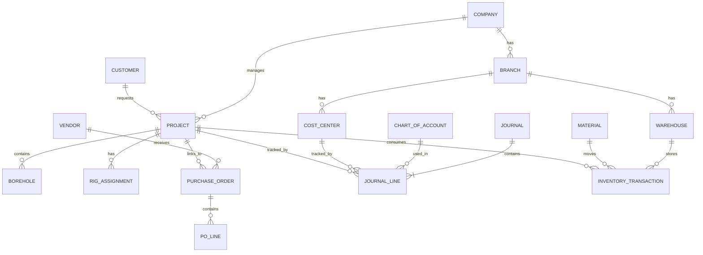

# Database Schema & ERD

## 1. Master Data Module
- **users**: id, username, email, password_hash, role_id, is_active
- **roles**: id, name, description
- **permissions**: id, name, module
- **companies**: id, code, name, address, tax_id
- **branches**: id, company_id, code, name
- **cost_centers**: id, branch_id, code, name
- **chart_of_accounts**: id, account_code, account_name, account_type (Asset, Liability, Equity, Revenue, Expense), normal_balance, is_active
- **tax_codes**: id, code, name, rate
- **vendors / customers**: id, code, name, npwp, address, contact
- **equipment**: id, code, name, category, hourly_rate, status
- **materials**: id, code, name, uom, category
- **warehouses**: id, branch_id, code, name, type (Central, Site)

## 2. Project Management Module (Job Costing)
- **projects**: id, company_id, customer_id, code, name, status, contract_value
- **areas / work_packages / activities**: hierarchical breakdown
- **boreholes**: id, project_id, code, depth, status
- **rig_assignments**: id, project_id, equipment_id, start_date, end_date

## 3. Procurement & Inventory Module
- **purchase_orders**: id, po_number, vendor_id, project_id, date, status, total
- **po_lines**: id, po_id, material_id, qty, unit_price, total
- **inventory_transactions**: id, warehouse_id, material_id, project_id, type (IN/OUT), qty, unit_cost, date, ref_id

## 4. Finance & Accounting Module
- **journals**: id, journal_number, date, description, ref_type, ref_id, status
- **journal_lines**: id, journal_id, account_id, cost_center_id, project_id, debit, credit
- **ap_invoices**: id, invoice_number, vendor_id, po_id, amount, tax, status
- **ar_invoices**: id, invoice_number, customer_id, project_id, amount, tax, status

## ERD (Mermaid)

